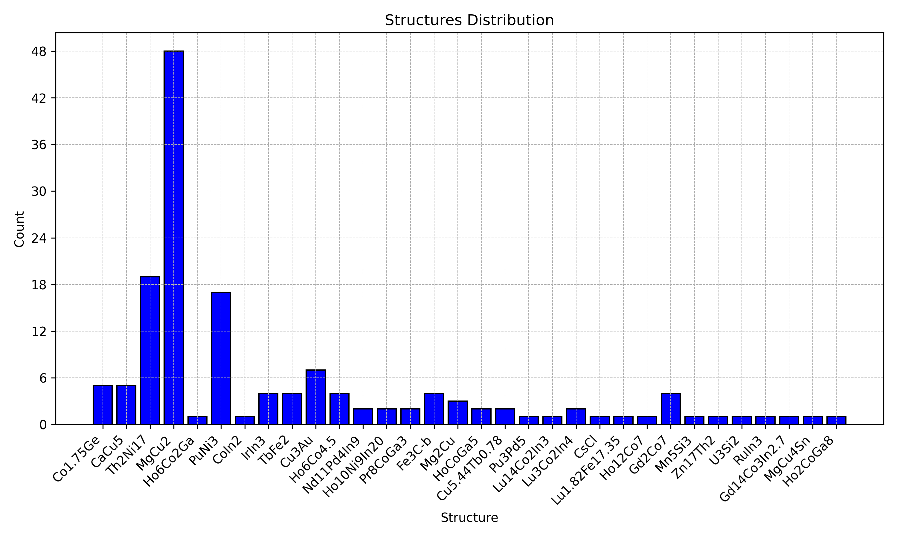

# Getting started

The purpose of this guide is to illustrate some of the main features that
`cifkit` provides. It assumes a very basic knowledge of Python.

`cifkit` is an open source CIF library that supports supercell generation and
provide tools for high-throuhgput analysis. It also provides various tools for
determining coordination numbers, plotting polyhedrons from each site based on
the coordination numbers, bond fractions, move and copy `.cif` files based on a
set of attributes, and determine atomic mixing information in 2-3 lines of code.

### Google Codelab

You can also run the examples using Google Codelab by clicking the link below:

<a href="https://colab.research.google.com/drive/1mZLFWyYblc2gxRqjP7CejZcUNGbQBzwo#scrollTo=WzjDKPmC5I67" target="_blank">
    
</a>

## Statement of need

In solid state chemistry and materials science, the Crystallographic Information
File (CIF) [@hall_crystallographic_1991] is the predominant file format used to
store and distribute crystal structure information. There are open-source Python
packages that read, edit, and create CIF files. Python Materials Genomics
(pymatgen) [@ong_python_2013] offers functionalities beyond the aforementioned
features, such as generating electronic structure properties and phase diagrams.
Similarly, the Atomic Simulation Environment (ASE) [@larsen_atomic_2017]
provides a suite of powerful tools for generating and running atomistic
simulations.

`cifkit` distinguishes itself from existing libraries by offering higher-level
functions and variables that enable users to perform complex tasks efficiently
with a few lines of code. `cifkit` not only facilitates the visualization of
coordination geometry from each site but also extracts physics-based features
like volume and packing efficiency, crucial for structural analysis in ML tasks.
Additionally, it extracts atomic mixing information at the bond pair level—tasks
that would otherwise require extensive manual effort using GUI-based tools like
VESTA, Diamond, and CrystalMaker, due to the lack of readily available
higher-level functions.

Further enhancing its utility, cifkit excels in sorting, preprocessing, and
understanding the distribution of underlying CIF files. Common issues in CIF
files from databases, such as incorrect loop values and missing fractional
coordinates, are systematically addressed as cifkit standardizes and filters out
ill-formatted files. It also preprocesses atomic site labels, transforming
labels such as 'M1' to 'Fe1' in files with atomic mixing. Beyond error
correction, cifkit provides functionalities to copy, move, and sort files based
on attributes like coordination numbers, space groups, unit cells, and shortest
distances. It also excels in visualizing and cataloging CIF files, organizing
them based on supercell size, tags, coordination numbers, elements, and atomic
mixing, among other parameters.

## Quotes

Here is a quote illustrating how `cifkit` addresses one of the challenges
mentioned above.

> "I am building an X-Ray diffraction analysis (XRD) pattern visualization
> script for my lab using `pymatgen`. I feel like `cifkit` integrated really
> well into my existing stable of libraries, while surpassing some alternatives
> in preprocessing and parsing. For example, it was often unclear at what stage
> an error occurred—whether during pre-processing with `CifParser`, or XRD plot
> generation with `diffraction.core` in `pymatgen`. The pre-processing logic in
> `cifkit` was communicated clearly, both in documentation and in actual
> outputs, allowing me to catch errors in my data before it was used in my
> visualizations. I now use `cifkit` by default for processing CIFs before they
> pass through the rest of my pipeline." - Alex Vtorov

## Overview

Designed for individuals with minimal programming experience, `cifkit` provides
two primary objects: `Cif` and `CifEnsemble`.

### Cif

**`Cif`** is initialized with a `.cif` file path. It parses the `.cif` file,
generates supercells, and computes nearest neighbors. It also determines
coordination numbers using four different methods and generates polyhedrons for
each site.

```python
from cifkit import Cif
from cifkit import Example

# Initalize with the example file provided
cif = Cif(Example.Er10Co9In20_file_path)

# Print attributes
print("File name:", cif.file_name)
print("Formula:", cif.formula)
print("Unique element:", cif.unique_elements)
```

### CifEnsemble

**`CifEnsemble`** is initialized with a folder path containing `.cif` files. It
identifies unique attributes, such as space groups and elements, across the
`.cif` files, moves and copies files based on these attributes. It generates
histograms for all attributes.

```python
from cifkit import CifEnsemble
from cifkit import Example

# Initialize
ensemble = CifEnsemble(Example.ErCoIn_folder_path)

# Get unique attributes
ensemble.unique_formulas
ensemble.unique_structures
ensemble.unique_elements
ensemble.unique_space_group_names
ensemble.unique_space_group_numbers
ensemble.unique_tags
ensemble.minimum_distances
ensemble_test.supercell_atom_counts
```

## Tutorial and documentation

You may use example `.cif` files that can be easily imported, and you can visit
the documentation page [here](https://bobleesj.github.io/cifkit/).

## Installation

To install

```bash
pip install cifkit
```

You may need to download other dependencies:

```bash
pip install cifkit pyvista gemmi
```

`gemmi` is used for parsing `.cif` files. `pyvista` is used for plotting
polyhedrons.

Please check the `pyproject.toml` file for the full list of dependencies.

## Testing

To run test locally.

```python
# Install all dependencies in editable mode
pip install -e .

# Run test
pytest
```

## Visuals

### Polyhedron

You can visualize the polyhedron generated from each atomic site based on the
coordination number geometry. In our research, the goal is to map the structure
and coordination number with the physical property.

```python
from cifkit import Cif

# Example usage
cif = Cif("your_cif_file_path")
site_labels = cif.site_labels

# Loop through each site
for label in site_labels:
    # Dipslay each polyhedron, a file saved for each
    cif.plot_polyhedron(label, is_displayed=True)
```


### Histograms

You can use `CifEnsemble` to visualize distributions of file counts based on
specific attributes, etc. Learn all features from the documentation provided
[here](https://bobleesj.github.io/cifkit/).

By formulas:


By structures:



## Open-source projects using cifkit

- CIF Bond Analyzer (CBA) - extract and visualize bonding patterns -
  [DOI](https://doi.org/10.1016/j.jallcom.2023.173241) |
  [GitHub](https://github.com/bobleesj/cif-bond-analyzer)
- CIF Cleaner - move, copy .cif files based on attributes -
  [GitHub](https://github.com/bobleesj/cif-cleaner)
- Structure Analyzer/Featurizer (SAF) - extract physics-based features from .cif
  files - [GitHub](https://github.com/bobleesj/structure-analyzer-featurizer)

## How to ask for help

`cifkit` is also designed for experimental materials scientists and chemists.

- If you have any issues or questions, please feel free to reach out or
  [leave an issue](https://github.com/bobleesj/cifkit/issues).

## How to contribute

Here is how you can contribute to the `cifkit` project if you found it helpful:

- Star the repository on GitHub and recommend it to your colleagues who might
  find `cifkit` helpful as well.
  [](https://github.com/bobleesj/cifkit/stargazers)
- Fork the repository and consider contributing changes via a pull request.
  [](https://github.com/bobleesj/cifkit/network/members).
  Check out
  [CONTRIBUTING.md](https://github.com/bobleesj/cifkit/blob/main/CONTRIBUTING.md)
  for instructions.
- If you have any suggestions or need further clarification on how to use
  `cifkit`, please feel free to reach out to Sangjoon Bob Lee
  ([@bobleesj](https://github.com/bobleesj)).

## Contributors

`cifkit` has been greatly enhanced thanks to the contributions from a diverse
group of researchers:

- Anton Oliynyk: original ideation with `.cif` files
- Alex Vtorov: tool recommendation for polyhedron visualization
- Danila Shiryaev: testing as beta user
- Fabian Zills ([@PythonFZ](https://github.com/PythonFZ)): suggested tooling
  improvements
- Emil Jaffal ([@EmilJaffal](https://github.com/EmilJaffal)): initial testing
  and bug report
- Nikhil Kumar Barua: initial testing and bug report
- Nishant Yadav ([@sethisiddha1998](https://github.com/sethisiddha1998)):
  initial testing and bug report
- Siddha Sankalpa Sethi ([@runzsh](https://github.com/runzsh)): initial testing
  and bug report in initial testing and initial testing and bug report

We welcome all forms of contributions from the community. Your ideas and
improvements are valued and appreciated.

## Citation

Please consider citing `cifkit` if it has been useful for your research:

- cifkit – Python package for high-throughput .cif analysis,
  https://doi.org/10.5281/zenodo.12784259

## Installation

Please use one of the Python versions (>=3.10) and the latest PyPI version
below!


[](https://pypi.python.org/pypi/cifkit)

Install `cifkit` via:

```bash
pip install cifkit
```

You may need to download other dependencies:

```bash
pip install cifkit pyvista gemmi
```

`gemmi` is used for parsing `.cif` files. `pyvista` is used for plotting
polyhedrons.

## Start with CifEnsemble

`cifkit` offers a class called `CifEnsemble` which handles many `.cif` files in
a high-throuhgput way. You can initialize the object using the folder path
containing `.cif` files shown below.

```python
from cifkit import CifEnsemble

# Initialize
ensemble = CifEnsemble("tests/data/cif/ensemble_test")

# Initialize including nested files
ensemble = CifEnsemble("tests/data/cif/ensemble_test", add_nested_files=True)

# Folder path
ensemble.cif_folder_path
# "tests/data/cif/ensemble_test"

```

If you do not have `.cif` files for testing, `cifkit` also provides a set of
`.cif` files accessible.

```python
from cifkit import CifEnsemble, Example
from cifkit import Example

# Initalize with the file path
ensemble = CifEnsemble(Example.ErCoIn_big_folder_path)
```

### Get unique attributes

Use the `ensemble` object to get unique attributes such as elements, formulas,
etc.

```python
# Unique formulas
ensemble.unique_formulas
# {"EuIr2Ge2", "CeRu2Ge2", "LaRu2Ge2", "Mo"}

# Unique structures
ensemble.unique_structures
# {"CeAl2Ga2", "W"}

# Unique elements
ensemble.unique_elements
# {"La", "Ru", "Ge", "Ir", "Eu", "Ce", "Mo"}

# Unique space group names
ensemble.unique_space_group_names
# {"I4/mmm", "Im-3m"}

# Unique space group numbers
ensemble.unique_space_group_numbers
# {139, 229}

# Unique tags
ensemble.unique_tags
# {"hex", "rt", "rt_hex", ""}
```

### Get distances and supercell size per file

The following computes the size of each supercell and the minimum distance per
file.

```python
# Get min distance per file
ensemble.minimum_distances
# [("tests/data/cif/ensemble_test/250709.cif", 2.725),
# ("tests/data/cif/ensemble_test/300171.cif", 2.383),
# ("tests/data/cif/ensemble_test/300170.cif", 2.28)]

# Get supercell size per file
ensemble_test.supercell_atom_counts
# [("tests/data/cif/ensemble_test/250709.cif", 54),
# ("tests/data/cif/ensemble_test/300171.cif", 360),
# ("tests/data/cif/ensemble_test/300170.cif", 360)]
```

### Filter files by attributes

The following returns a set of file paths to each `.cif` file.

```python
# By formulas
ensemble_test.filter_by_formulas(["LaRu2Ge2"])
ensemble_test.filter_by_formulas(["LaRu2Ge2", "Mo"])

# By structures
ensemble_test.filter_by_structures(["W"])
ensemble_test.filter_by_structures("CeAl2Ga2")

# By space group
ensemble_test.filter_by_space_group_names("Im-3m")

# By space group numbers
ensemble_test.filter_by_space_group_numbers([139])
```

### Move and copy files

Now you have a set of file paths with example below, you can copy and move files
to a specific directroy. For high-throuhgout analysis, you might be interested
in separating files based on tags, elements, coordination numbers, etc.

```python
file_paths = {
    "tests/data/cif/ensemble_test/300169.cif",
    "tests/data/cif/ensemble_test/300171.cif",
    "tests/data/cif/ensemble_test/300170.cif",
}

# To move files
ensemble.move_cif_files(file_paths, dest_dir_path)

# To copy files
ensemble.copy_cif_files(file_paths, dest_dir_path)
```

## Research projects using `cifkit`

- CIF Bond Analyzer (CBA) - extract and visualize bonding patterns -
  [DOI](https://doi.org/10.1016/j.jallcom.2023.173241) |
  [GitHub](https://github.com/bobleesj/cif-bond-analyzer)
- CIF Cleaner - move, copy .cif files based on attributes -
  [GitHub](https://github.com/bobleesj/cif-cleaner)
- Structure Analysis/Featurizer (SAF) - build geometric features for binary,
  ternary compounds -
  [GitHub](https://github.com/bobleesj/structure-analyzer-featurizer)
